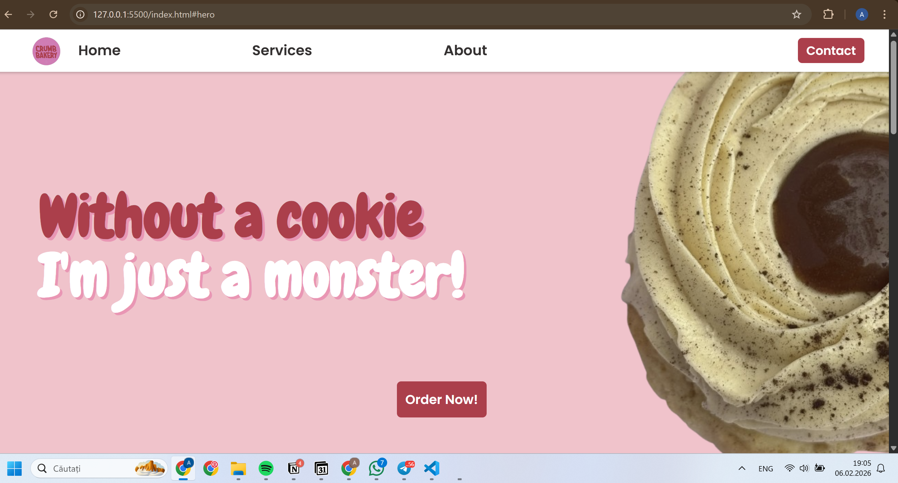
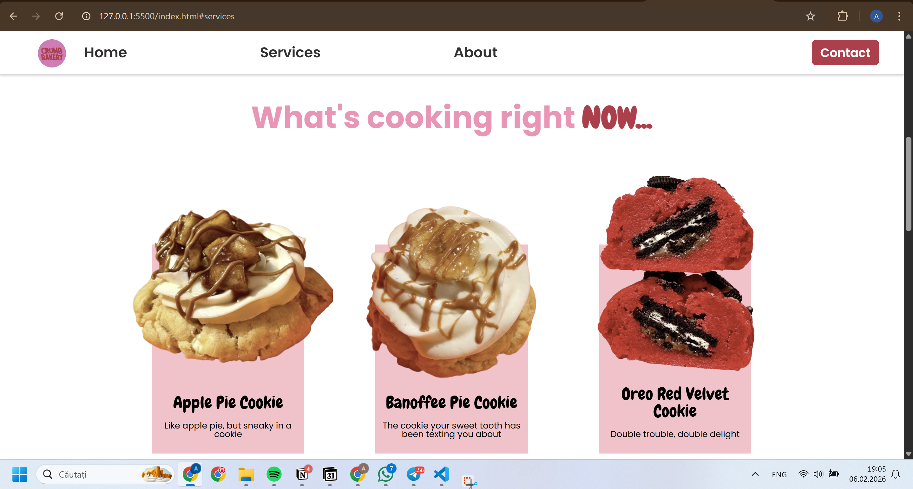
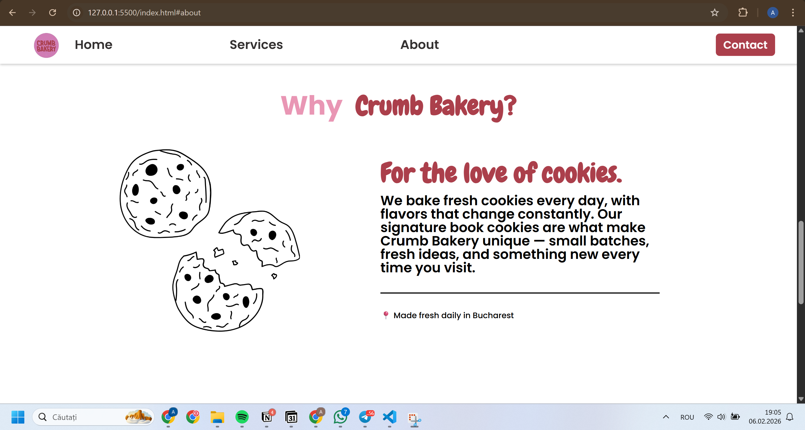
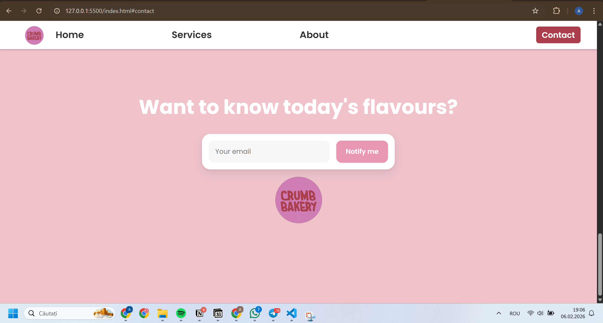

# Lab 2 - Crumb Bakery Landing Page

## Description
This is a landing page for **Crumb Bakery**, a real cookie shop located in **Bucharest**.  
The website showcases the bakery's products, features, and contact section, allowing visitors to see the cookies, learn about the bakery, and sign up to get notified about new flavors.

The page is built using **vanilla HTML and CSS** and is fully responsive across desktop, tablet, and mobile devices.

## Features
- Fixed navigation with links to all sections  
- Hero section with slogan and call-to-action button  
- Services section showcasing featured cookies  
- About section highlighting the bakery’s story  
- Contact section with email notifications and Instagram link  
- Fully responsive design for different screen sizes

## Sections
1. **Home (Hero)** – Introduction with bakery slogan and "Order Now!" button  
2. **Services** – Featured cookies with images and descriptions  
3. **About** – Story behind Crumb Bakery  
4. **Contact** – Email subscription form and Instagram link  

## Tech Stack
- HTML5  
- CSS (including media queries for responsiveness)  
- GitHub Pages (for deployment)

## Screenshots
  
  
  
  

## Live Demo
[View Live Site](https://anastasiat18.github.io/tum-web-lab2/)

## Additional Notes
- All code is in `index.html` and `reset.css`  
- Fonts used: **Chewy**, **Poppins**, and **Gaegu** from Google Fonts  
- No frameworks or libraries were used
