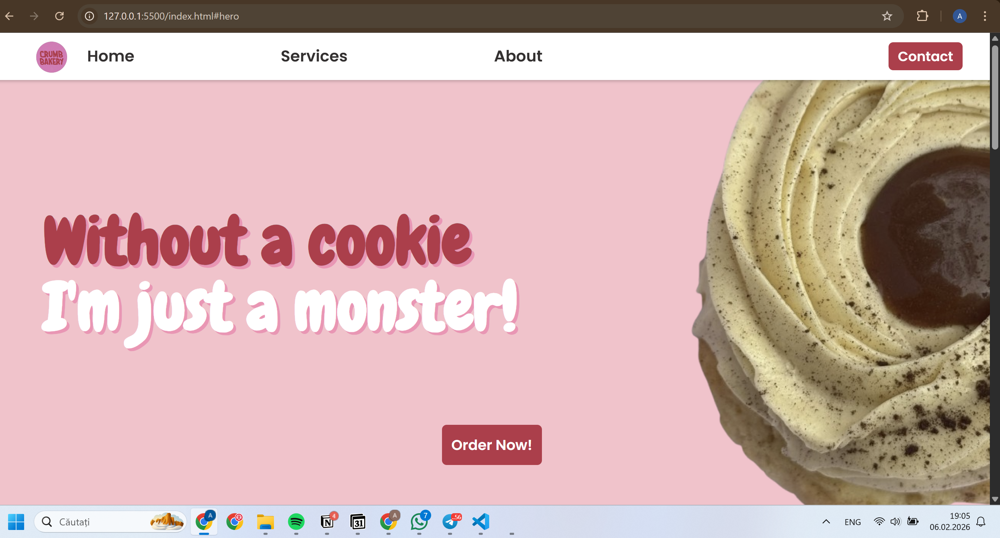
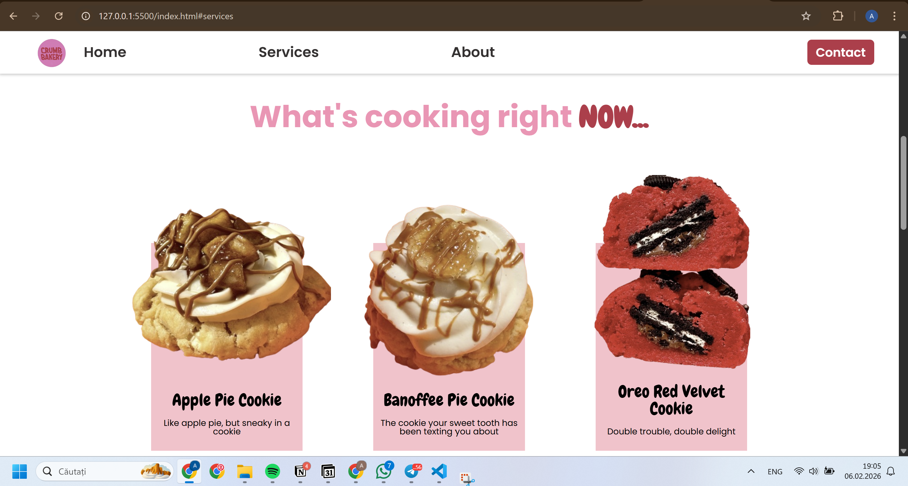
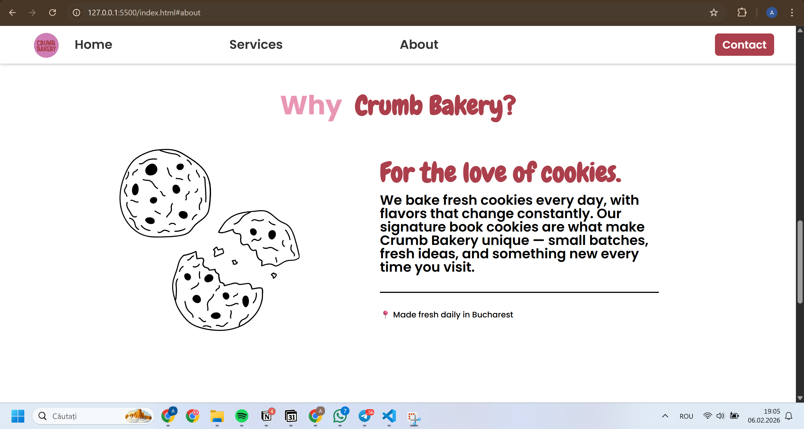
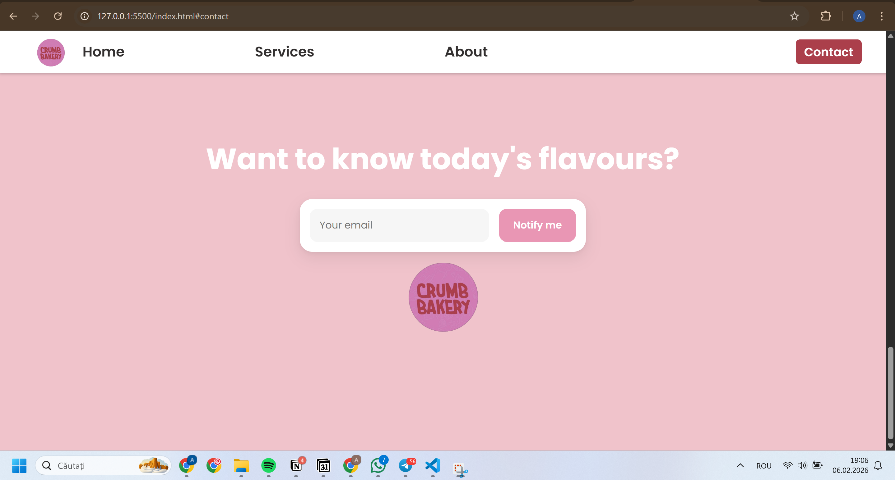
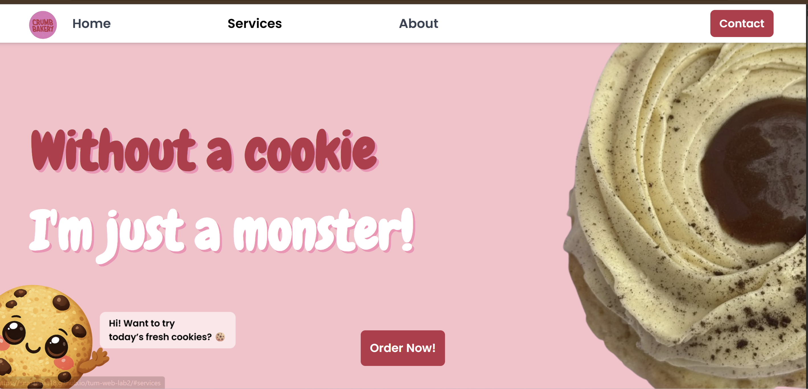

# Lab 2 - Crumb Bakery Landing Page

## Description
This is a landing page for **Crumb Bakery**, a real cookie shop located in **Bucharest**.  
The website showcases the bakery's products, features, and contact section, allowing visitors to see the cookies, learn about the bakery, and sign up to get notified about new flavors.

The page is built using **vanilla HTML and CSS** and is fully responsive across desktop, tablet, and mobile devices.

## Features
- Fixed navigation with links to all sections  
- Hero section with slogan and call-to-action button  
- Services section showcasing featured cookies  
- About section highlighting the bakery’s story  
- Contact section with email notifications and Instagram link  
- Fully responsive design for different screen sizes

## Sections
1. **Home (Hero)** – Introduction with bakery slogan and "Order Now!" button  
2. **Services** – Featured cookies with images and descriptions  
3. **About** – Story behind Crumb Bakery  
4. **Contact** – Email subscription form and Instagram link  

## Tech Stack
- HTML5  
- CSS (including media queries for responsiveness)  
- GitHub Pages (for deployment)

## Screenshots
  
  
  
  

## Additional Notes
- All code is in `index.html` and `reset.css`  
- Fonts used: **Chewy**, **Poppins**, and **Gaegu** from Google Fonts  
- No frameworks or libraries were used

---

# Lab 3 - Responsive Design & Mascot

## Description
For Lab 3, the landing page was enhanced to improve **responsiveness** and include a **mascot** similar to Microsoft Clippy.  
This ensures that the page is user-friendly on mobile devices and adds interactivity to engage visitors.

## Customer Requirements Implemented
- **Mobile responsiveness**:
  - All elements scale correctly for desktop and mobile  
  - Call-to-action button remains visible on mobile  
  - Mobile-only elements included (the navigation links were transformed into a **toggle menu button** on mobile devices)  
- **Mascot**:
  - Smiling, waving cookie representing the bakery theme  
  - Appears **delayed from the left corner** of the page  
  - On hover, the mascot **wiggles** and displays the message:  
    `Hi! Want to try today’s fresh cookies? 🍪`  
  - Clicking the mascot navigates to the **contact section**  
  - Behavior differs slightly on mobile: the mascot wiggles and the text appears immediately when it shows  
  - On all devices, the mascot **disappears automatically after a few seconds**

## Dev Requirements Implemented
- Git history maintained with multiple commits  
- Page deployed on **GitHub Pages** with live link  
- Partial migration of the website to **TailwindCSS**

## Tech Stack
- HTML5  
- TailwindCSS (for part of the website)  
- CSS animations  
- GitHub Pages for deployment  

## Screenshots
  

## Live Demo
[View Live Lab 3](https://anastasiat18.github.io/tum-web-lab2/)

---

# Lab 4 - Static Site Generator & Git CMS

## Description
For Lab 4, the Crumb Bakery landing page was migrated to a Static Site Generator (SSG) using Astro and integrated with a Git-based CMS (Decap CMS).

This allows the client to edit content directly via a CMS without touching code, while maintaining a modern developer workflow. The site retains all previous features from Lab 3, including responsive design and mascot animation.

## Customer Requirements Implemented
- Migrate the landing page to a Static Site Generator (Astro)
- Integrate a Git-based CMS (Decap CMS) for easy content editing
- Ensure the TailwindCSS framework is fully integrated
- Preserve previous responsive design and mascot behavior
- All major content sections (Hero, About, Services, Contact, Navigation, Mascot) are CMS-editable

## Dev Requirements Implemented
- Used Astro as the SSG (no frontend frameworks like React/Vue)
- Integrated Decap CMS for Git-based content editing
- Structured the site with editable Markdown files for each section:
  - Hero.md
  - About.md
  - Services.md
  - Contact.md
  - Nav.md
  - Mascot.md
- Implemented CMS configuration for all fields (title, subtitle, images, highlights, etc.)
- Deployed live on Netlify with branch-based previews for pull requests
- Maintained clean git history with commits for SSG migration and CMS setup

## Tech Stack
- Astro – Static Site Generator
- Decap CMS – Git-based content management
- TailwindCSS – Styling framework
- HTML, CSS – Core structure and animations
- Netlify – Deployment and preview environment

## Live Demo
[View Live Lab 4](https://taupe-pixie-57d72a.netlify.app/)
